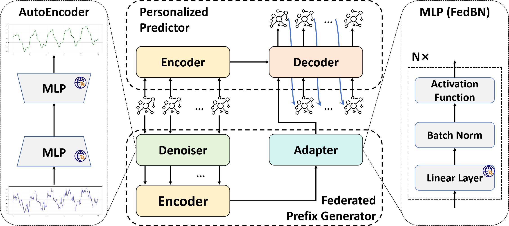

# AutoFed

**Article:** "AutoFed: Manual-Free Federated Traffic Prediction via Personalized Prompt" (under review)


## 1. Workflow




## 2. Dataset

Please download the dataset from the [New York City Taxi and Limousine Commission (TLC) Trip Record Data - Registry of Open Data on AWS](https://registry.opendata.aws/nyc-tlc-trip-records-pds/). After downloading, navigate to the `data_process` folder and execute the following command to begin processing the data:

1. **client split**

```shell
python data_split.py
```

2. **data pre-process**

```shell
python data_process.py
```


## 3. How to Run

```shell
python main.py --num_client <client amount (1-10)> --mode <0/1/2>
```

Modes 0, 1, and 2 correspond to Scenarios S1, S2, and S3 in the paper, respectively.


## 4. Citation

```

```

